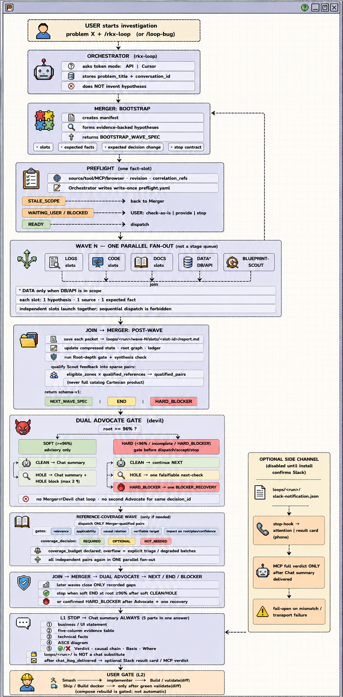
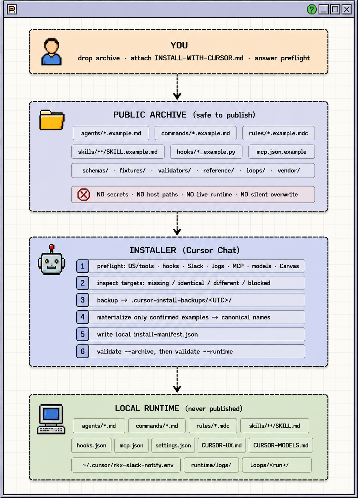

# 🧙‍♂️✨💫 CURSORCERER

> **Ready-Made Debugging Blueprint Control Plane for Cursor: Agents, Commands, Rules, Skills, Hooks, Schemas & Validators in [1] Loop**


---

## 🔥 What It Is

**A control plane that turns a symptom into a provable root cause.**

```text
Symptom
   → Parallel evidence
   → Confidence + CONFIDENCE_BASIS
   → Chat summary
   → Explicit gate (Smash)
   → Code change / validate(diff)
```

The output is a decision with an evidence trail — not a model answer from thin air.
Code changes happen only after an explicit gate.

---

## 💡 How It Works

Root-cause search is not hidden inside agent magic. **Before launch, the system describes:**

```text
The problem → Working scope → Hypotheses
                                      ↓
Decision-change criteria ← Expected facts ← Evidence sources
        ↓
Stop condition → Required capabilities → Escalation conditions
```

**☝🏼 The agent must show:**
- What it is checking
- Why it is checking it
- Which facts it expects
- How those facts will change the decision
- What happens if the evidence is unavailable

---

## ✈️ Preflight

**Before capability-dependent work starts**, the system checks what is actually available. Typical capabilities include:

```text
tools    models    browser    logs    mcp    slack    database    api access
```


**Preflight resolves into:**

```text
ready    waiting_user    blocked    stale_scope
```

<br>

- `READY` → Dispatch
- `STALE_SCOPE` → Merger replanning
- `WAITING_USER` / `BLOCKED` → Check as-is · Provide · Stop
- Slack is optional and is not required for this decision.

```text
USER: symptom / task
        │
        ▼
preflight  (tools · models · browser · logs · mcp · slack · database · api access)
        │
        ├── READY         → Dispatch (full or degraded)
        ├── WAITING_USER ─┐
        ├── BLOCKED      ─┴→ Cursor: Check as-is · Provide · Stop
        │                      ├── Check as-is → Dispatch (may be degraded)
        │                      ├── Provide     → wait → preflight again
        │                      └── Stop        → no dispatch
        └── STALE_SCOPE   → Merger replanning

```

---

## 🔄 RKX Loop

1. **RKX Loop is the main automated investigation workflow.** Each wave consists of independent narrow slots:
- `LOGS` — facts from logs
- `CODE` — facts from code
- `DOCS` — contracts and documentation
- `DATA` — database and API, only when they are in scope
- `BLUEPRINT-SCOUT` — search for matching reference entries

2. **After the slots finish, Merger:**

```text
Saves evidence packets → Merges facts → Records contradictions
                                                         ↓
Evaluates confidence + CONFIDENCE_BASIS ← Checks Root-depth ← Updates the root graph
        ↓
Decides whether a next step is needed → Forms NEXT_WAVE_SPEC / END / HARD_BLOCKER
```

3. **Advocate checks the leading root** and looks for alternative explanations, weak points, and unconfirmed transitions. Important outcomes include:
- `CLEAN`
- `HOLE`
- `HARD_BLOCKER`
- `BLOCKER_RECOVERY`

When confidence is insufficient, it forms one concrete next check instead of starting an endless argument between agents. When the investigation reaches L1 Stop, Cursor delivers the Chat summary. It contains:

- Business / UI statement
- Five-column evidence table
- Technical facts
- Structure diagram
- ✅ or ❌ verdict · Causal chain · Basis · Where

```text
Chat summary  ≠  loops/<run>/ artifacts
        │
        ▼
Smash → Build → validate(diff) → optional Ship
```

```text
bootstrap → preflight → parallel fan-out → merge → dual advocate
        │
        ├── NEXT_WAVE_SPEC → another wave
        ├── soft END       → L1 Chat summary
        └── HARD_BLOCKER   → BLOCKER_RECOVERY / Stop
                │
                ▼
         Smash → Build / validate(diff) → optional Ship
```

---

## 💎 What You Get

### 📘 Ready-Made Debugging Blueprint Control Plane

Instead of manually assembling the process from prompts, roles, and rules every time, the user gets ready-made scenarios:

```text
Bug investigation → Root-cause search → Fix planning
                                              ↓
UI / Browser evidence ← Diff validation ← Plan validation
        ↓
Design → Implementation → Validation / deploy gates → Reference coverage
```

**Each blueprint defines:**
- Which roles take part
- Which evidence is required
- Which scope is allowed
- Which results count as valid
- When to stop
- When to ask the user
- When to move to the next phase

---

## 🏛 Architecture

### Symptom → Chat summary → Smash → Ship



- Run artifacts are stored under `loops/<run>/`. Individual evidence packets are saved under: `loops/<run>/wave-N/slots/<slot-id>/report.md`

- The run artifacts preserve the investigation state and evidence trail, but they do not replace the required user-facing Chat summary.

---

## 🧱 Components

### 📂 What Ships

| Area | Public Form | Why It Exists |
| :--- | :--- | :--- |
| **Agents** | `agents/*.example.md` | Role contracts and responsibility boundaries |
| **Commands** | `commands/*.example.md` | Slash entry points for launching blueprints |
| **Rules** | `rules/*.example.mdc` | Workflow, loops, forensics, browser, and token policy |
| **Skills** | `skills/**/SKILL.example.md` | Phase and specialized workflows |
| **Hooks** | `hooks/*_example.py`, `*.example.sh` | Lifecycle escalation and human-readable summary |
| **Schemas** | `schemas/*.json` | Machine-readable protocol contracts |
| **Fixtures** | `scripts/fixtures/` | Verification scenarios |
| **Validators** | `scripts/` | Offline archive and runtime checks |
| **Reference** | `reference/` | Blueprint registry and telephony catalog |
| **Loops** | `loops/` | Run templates and decision surfaces |
| **Vendor** | `vendor/generated/` | Optional Canvas declarations |

### 🤖 Agent Crew

| Role | Responsibility |
| :--- | :--- |
| **`rkx-loop`** | Single orchestrator of the investigation loop |
| **`merger`** | Bootstrap, synthesis, and planning of later waves |
| **`fact-slot`** | Checking one narrow evidence question |
| **`blueprint-scout`** | Finding reference patterns and coverage candidates |
| **`devil`** | Adversarial check of the leading root |
| **`implementer`** | L2 changes after explicit user permission |
| **`boss`** | Manual extra check of a disputed decision |

Agents are split by responsibility:

- The evidence agent does not make the final decision
- Merger does not write product code
- Advocate does not start a new wave on its own
- Implementer does not start edits without a user gate
- The Slack hook does not replace Chat summary

---

### 🔐 Public Boundary

The public archive contains examples and contracts. What stays local:
- Materialized runtime files
- Project-specific skills
- Local MCP overlays
- Run artifacts
- Runtime logs
- Install manifest
- Environment configuration
- Personal Cursor settings

The public version must not depend on one machine, one workspace, or one set of access rights.

---

## ⚡ Installation

The public archive is installed through Cursor Chat into one of two targets:

- **Project-local** — `<project>/.cursor` (scoped to that workspace)
- **User-global** — `~/.cursor` (shared across projects on this machine)

Pick the target before materialization. Do not mix the two without an explicit plan. 




The archive also includes the loop-flow diagram in `assets/`; these images are
part of the explicit public binary allowlist.

**Installation:**
1. Runs environment preflight
2. Checks capability availability
3. Compares target files
4. Shows conflicts
5. Creates a backup
6. Materializes confirmed examples
7. Writes the install manifest
8. Runs validation

There is no need to assemble `.cursor` by hand, hunt for the right files, or guess the wiring order.

```bash
git clone <public-archive-url>
cd <archive-directory>
```

---

## ⚖️ License

MIT. See `LICENSE` and `NOTICE`.

---

## 👤 About the author

I'm Vladislav Rakhnianskii, solo founder of **RKX — Ad-to-Revenue OS for Meta Advertisers**.

RKX connects acquisition, measurement, sales, messaging, and AI workflows around Meta in one operating system.

I have been building the platform full-time since 2024, completely self-funded. We started charging two months ago and currently have:
- 5 paying customers
- $900 MRR
- $3,000+ collected
- 100% referral-driven growth
- Zero paid marketing

The product is already built and operational. I'm currently looking for a **strategic MarTech / SaaS angel investor** to help scale the company.

**Product:** 
https://rakhnianskii.com/

**Reach out:** 
https://wa.me/message/E26AP7ZUDRTLD1

**LinkedIn:** 
https://www.linkedin.com/in/rakhnianskii/